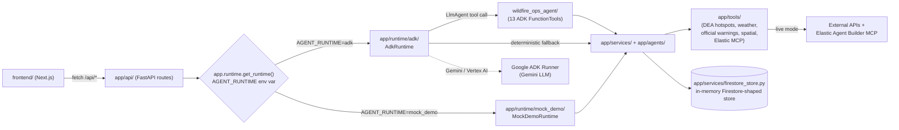
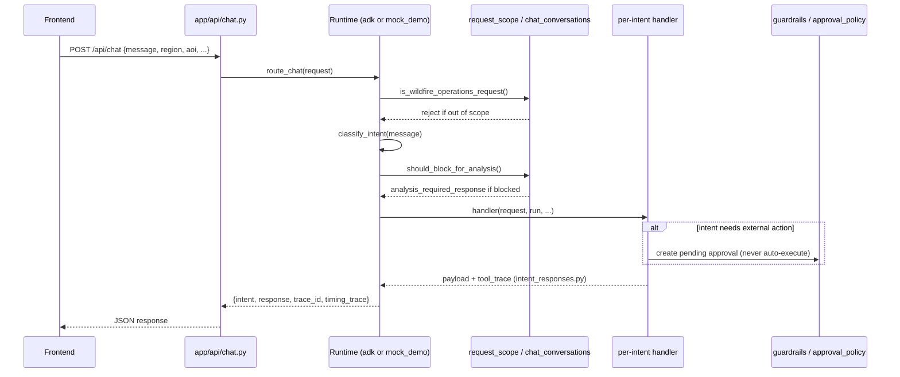
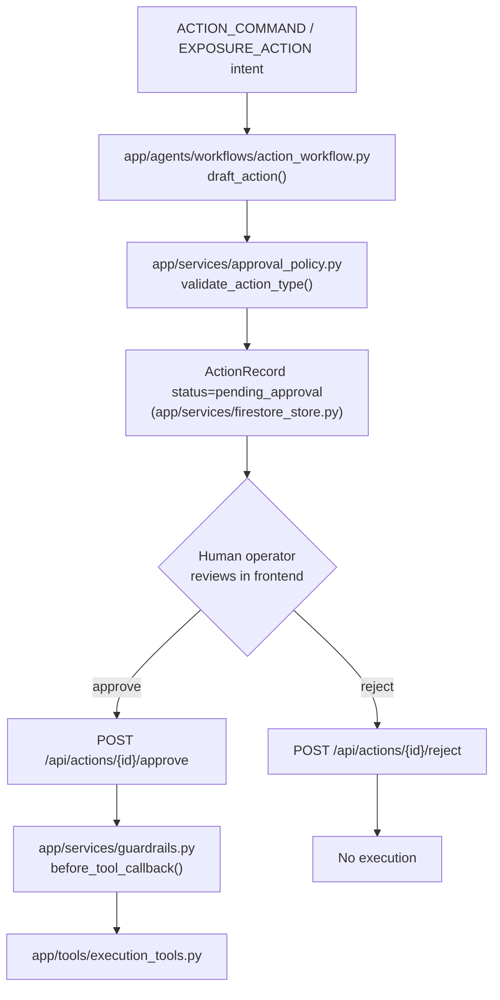
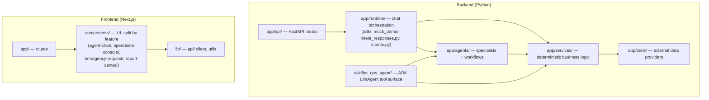

# Architecture

Living document. Update this when the runtime/package layout changes —
diagrams that drift from the code are worse than no diagram.

## System overview

Three runtimes implement the same chat contract:
- **`wildfire_ops_agent/`** — the LLM tool surface. Gemini picks one of 13
  `FunctionTool`s per turn; each tool builds a `ChatRequest` from ADK session
  state, calls the same `app/services` / `app/agents` logic as the other two
  runtimes, and stashes its result back into session state.
- **`app/runtime/adk/`** — drives the ADK `Runner`/Gemini turn, then
  validates the result and falls back to deterministic dispatch
  (`dispatch.py`) if Gemini didn't call a required tool or returned an
  off-target answer (`guardrails.py`, `response.py`, `synthesis.py`).
- **`app/runtime/mock_demo/`** — no LLM call at all; dispatches directly by
  classified intent (`handlers.py`) for demos and CI.

All three route intent-to-trace/response shaping through
`app/runtime/intent_responses.py` so the three stay behaviorally identical —
see the "do not change casually" note in `CLAUDE.md`.

## Chat request flow

## Approval / guardrail flow

External actions (public advisories, drafted communications) are never
executed directly — every path ends at a pending human approval:

## Folder responsibilities

