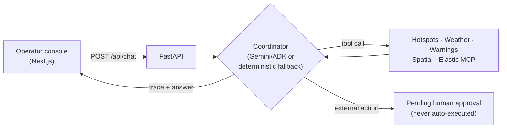

# 🔥 Wildfire Ops Copilot

**An emergency-operations console for wildfire monitoring** — AOI hotspot analysis, risk scoring, what-if scenarios, and approval-gated public advisories, backed by a Gemini/ADK agent that never answers without grounding in real evidence.

[](https://github.com/JianlingTang/wildfire-ops-copilot/actions/workflows/ci.yml)
[](LICENSE)


**🔗 [Live demo](https://wildfireops-tang-0606.web.app/)** · **[Backend health](https://wildfire-ops-backend-439532509169.australia-southeast1.run.app/health)** · **[Architecture](ARCHITECTURE.md)**

---

## What it does

- 📍 Focuses live Australian DEA hotspot AOIs by state and radius
- 💬 Routes operator chat through a Gemini/ADK coordinator with a deterministic fallback — never guesses when it can't ground an answer
- 🌦️ Combines weather, official warnings, spatial exposure, and Elastic Agent Builder MCP evidence into one risk score
- 📄 Produces reports, agent traces, risk trend/prediction charts, and hotspot heatmap visualizations
- 🧭 Runs what-if scenarios (e.g. "what if wind speed increases 20%?") against the same risk model
- ✅ Drafts public advisories and external actions that stay **pending approval** until a human operator signs off — the agent never executes them itself

## How a chat request flows



Three runtimes share this contract: the live Gemini agent, its deterministic fallback, and an LLM-free demo mode for CI/offline demos. See **[ARCHITECTURE.md](ARCHITECTURE.md)** for the full system, sequence, and approval-flow diagrams, and **[CLAUDE.md](CLAUDE.md)** for the folder map and the invariants this project can't casually break.

## Stack

| Layer | Technology |
|---|---|
| Frontend | Next.js (static export) on Firebase Hosting |
| Backend | FastAPI on Cloud Run |
| Agent runtime | Google ADK + Vertex AI Gemini, with a deterministic fallback |
| Evidence | Elastic Agent Builder MCP, DEA hotspots, weather, official warnings, spatial APIs |
| Demo storage | In-memory store behind a storage boundary |
| Production storage path | Firestore, for durable multi-instance records and serverless scaling |

## Quick start

```bash
python -m venv .venv
. .venv/bin/activate
pip install -e ".[dev]"
cp .env.example .env
cp frontend/.env.example frontend/.env.local
.venv/bin/uvicorn app.main:app --host 127.0.0.1 --port 8001
cd frontend && npm install && npm run dev -- --hostname 127.0.0.1 --port 3001
```

## Elastic MCP

Seed the demo index:

```bash
export ELASTICSEARCH_URL="https://your-elasticsearch-endpoint"
export ELASTIC_API_KEY="your-seed-api-key"
.venv/bin/python scripts/seed_elastic_wildfire_docs.py
```

MCP search tool:

- Index: `wildfire_ops_knowledge`
- Tool: `search_wildfire_ops_knowledge`

## Deploy

```bash
PROJECT_ID=your-gcp-project-id REGION=australia-southeast1 SERVICE_NAME=wildfire-ops-backend bash scripts/deploy_backend_cloud_run.sh
cd frontend && npm ci && npm run build && cd ..
firebase deploy --only hosting
```

## Demo cost controls

- Firebase authentication identifies each approved user.
- Paid analysis endpoints are limited to `20` requests per user per UTC day by default.
- The limiter is intentionally in memory for this short-lived, single-instance demo; a restart or redeploy resets it.
- Set `RATE_LIMIT_USER_DAILY_REQUESTS` to change the limit or `RATE_LIMIT_ENABLED=false` for local troubleshooting.
- Google Cloud Billing budgets send alerts; they do not by themselves stop services or guarantee a hard spending ceiling.

## Tests

```bash
ruff check .
mypy app tests
pytest -q
cd frontend && npm run lint && npm run build
bash scripts/smoke_test.sh
```

## Demo flow

1. Open the dashboard
2. Focus an AOI
3. Ask for today's report
4. Review trace, risk score, and report
5. Ask a what-if scenario
6. Draft a public advisory for approval

## License

[MIT](LICENSE)
